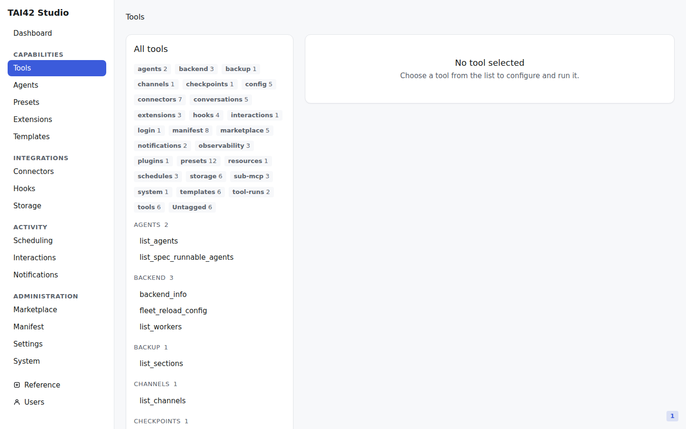
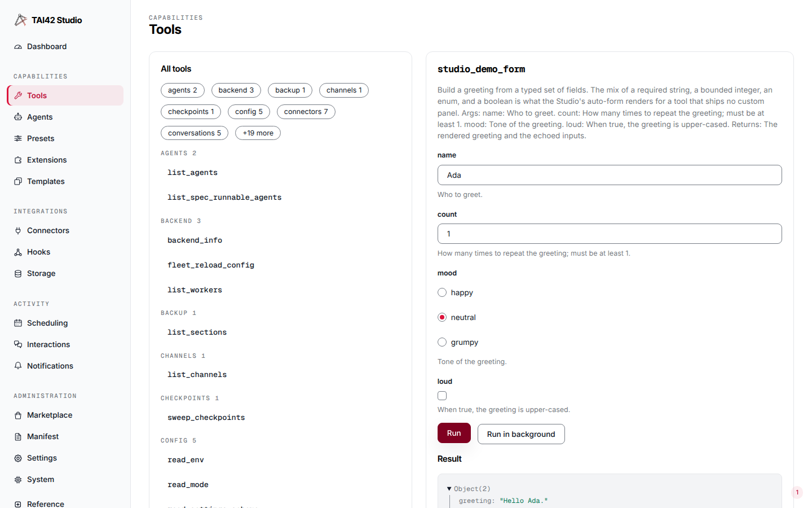

# tai-studio

[](https://github.com/tai42ai/tai-studio/actions/workflows/ci.yml)
[](LICENSE)

The Studio: a React 19 + TypeScript web UI — the platform's visual workbench for
a [`tai42-skeleton`](https://github.com/tai42ai/tai-skeleton) MCP server. Browse and exercise tools,
extensions, connectors, templates, and human-in-the-loop interactions against a
running skeleton, straight from the browser. It is the platform's web UI, and the
[documentation site](https://tai42.ai/studio) is its full doc home — the screens
tour, the sync-vs-background run modes, the admin console, API-key provisioning,
and the deploy notes all live there.

<p align="center">
  
  
</p>

> These screenshots (and the full set on the docs site) are regenerated by
> `bash e2e/scripts/docs-screenshots.sh`, which boots a fully-populated docs-demo
> backend and captures every screen in light and dark. It is a **maintainer
> command**: it needs Docker, `uv`, the Playwright chromium browser, and six
> checkouts beside this repo — `tai42-skeleton`, `tai-docs`, `tai42-agents`,
> `tai42-storage-local`, `tai42-toolbox`, and `tai42-accounts-postgres` (each
> overridable with its matching `*_DIR` environment variable). Rerun it after any
> UI or branding change. See `e2e/docs-demo/README.md`.

## Development

A pnpm-workspaces monorepo: the shell app `@tai42/studio-app` composes one package
per surface, and the Studio plugin contract, shared components, and hooks live in
`@tai42/studio-sdk` (`packages/studio-sdk`).

Requires **Node 22+** and **pnpm 11** — see the `packageManager` field in
`package.json` for the exact pinned version.

```bash
pnpm install
pnpm -r typecheck
pnpm -r lint
pnpm -r test
pnpm --filter @tai42/studio-app dev   # start the Vite dev server
```

The dev server proxies `/api` to a running skeleton — point it with
`VITE_API_PROXY_TARGET` (default `http://localhost:8765`), or copy
`.env.example` to `apps/studio/.env` to set it persistently. The env file must
sit in the app package, not the repo root: `apps/studio/vite.config.ts` reads it
with `loadEnv(mode, process.cwd(), 'VITE_')`, and `pnpm dev` runs Vite with
`apps/studio` as the working directory. New to TAI? Start with
[`tai42-skeleton`](https://github.com/tai42ai/tai-skeleton) — its quickstart boots a working server, then
point this Studio at it.

## Architecture

A pnpm-workspaces monorepo. Each surface of the app is its own package, and the
dependency direction is one-way: **app → features → sdk → api-client** (nothing
lower ever imports something higher).

- **`apps/studio`** — the shell. A code-first, typed TanStack Router route tree
  that the feature packages hang their pages on (features export page components,
  never routes), plus a runtime plugin loader that mounts third-party Studio
  plugins under a shell-owned catch-all route resolved from a registry.
- **`packages/studio-sdk`** — the plugin contract and the design system. It
  defines the plugin API a plugin implements, the contribution types, and the
  version-compatibility gate, and ships the shared UI components, hooks, and
  schema-driven auto-form every feature and plugin builds on. The host-only
  registry lives behind the separate `@tai42/studio-sdk/host` entry so a served
  plugin asset can never forge or enumerate it (see `SECURITY.md`).
- **`packages/api-client`** — the typed, zod-validated client for the skeleton's
  HTTP API. One schema per endpoint; every response is validated and every
  drift or failure throws. It holds no server state of its own.
- **`packages/features/*`** — one package per page surface (tools, agents,
  extensions, presets, templates, hooks, interactions, connectors, notifications,
  settings, system, observability, scheduling, manifest, marketplace, storage).
  Each exports its page component and imports only `@tai42/studio-sdk`,
  `@tai42/api-client`, and TanStack Query.
- **`e2e`** — Playwright specs that drive the built Studio against a real running
  skeleton backend, plus a reference plugin exercising the plugin boundary.

## Documentation

The Studio's screens, run modes, admin console, and deploy notes live in the
unified documentation site, and its plugin contract in the Studio SDK reference:

- Studio (the desktop workbench): https://tai42.ai/studio
- Studio SDK reference (`@tai42/studio-sdk` public API): https://tai42.ai/reference/studio-sdk

## License

Apache-2.0. See `LICENSE` and `NOTICE`.
